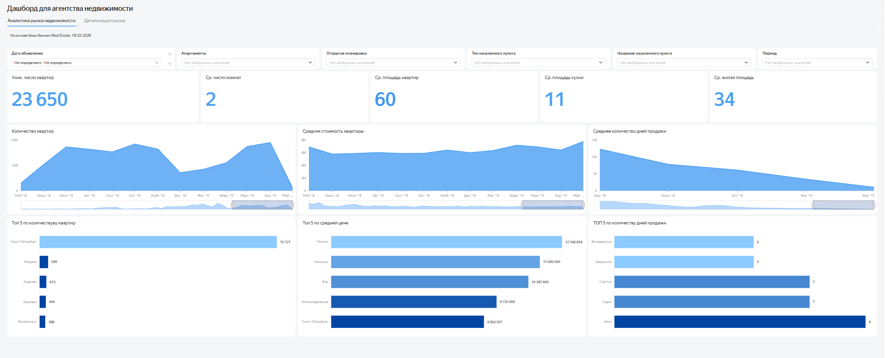
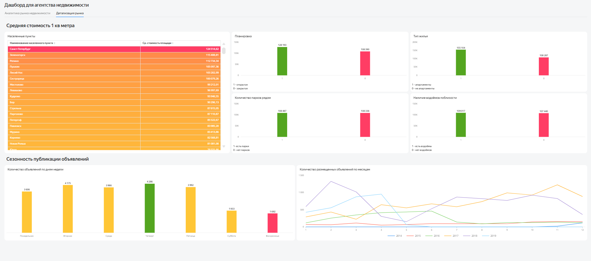

# Анализ рынка недвижимости Санкт-Петербурга и Ленинградской области


Анализ объявлений о продаже недвижимости в Санкт-Петербурге и населённых пунктах Ленинградской области. В проекте исследованы сроки активности объявлений, характеристики объектов и сезонность рынка, а также доработан интерактивный дашборд для агентства недвижимости.

**[Открыть интерактивный дашборд в Yandex DataLens](https://datalens.yandex/rnz52h7aca3ab?_share_link=public)** · **[Посмотреть SQL-запросы](sql/ad_hoc_analysis.sql)**

## Цель проекта

Определить наиболее перспективные сегменты рынка недвижимости, сравнить Санкт-Петербург и Ленинградскую область, выявить сезонные особенности публикации и снятия объявлений и подготовить инструменты для оперативного анализа показателей агентства.

## Данные

Исследование выполнено на данных сервиса недвижимости. Использованы четыре связанные таблицы:

| Таблица | Содержание |
|---|---|
| `advertisement` | дата публикации, срок активности и цена объекта |
| `flats` | площадь, комнаты, этаж, планировка и характеристики окружения |
| `city` | названия населённых пунктов |
| `type` | типы населённых пунктов |

Перед анализом исключены аномальные значения площади, количества комнат и балконов, а также высоты потолков на основе 1-го и 99-го перцентилей.

## Что сделано

- подготовлены SQL-запросы для очистки, объединения и агрегации данных;
- объявления разделены по региону и длительности активности;
- рассчитаны количество и доля объявлений, средние и медианные характеристики объектов;
- изучена сезонность публикации и снятия объявлений;
- выполнено сравнение Санкт-Петербурга и городов Ленинградской области;
- доработан дашборд: добавлены фильтры, KPI, детализация по периодам и новые визуализации;
- сформулированы рекомендации для выбора приоритетных сегментов.

## Ключевые результаты

- В анализируемой выборке представлено **11 217 объявлений Санкт-Петербурга** и **2 828 объявлений городов Ленинградской области**.
- В обоих регионах самая крупная группа — объявления, активные более полугода: **31,26%** в Санкт-Петербурге и **30,87%** в Ленинградской области.
- Объекты большей площади в среднем остаются активными дольше: в Санкт-Петербурге средняя площадь увеличивается примерно с **49 до 59,6 м²**, а в Ленинградской области — с **48,75 до 55,03 м²** при переходе от короткого к длительному сроку экспозиции.
- В Санкт-Петербурге стоимость квадратного метра заметно выше, чем в городах Ленинградской области; различия зависят от группы длительности активности объявления.
- Пики публикации объявлений приходятся на **февраль и ноябрь**, а пики снятия — на **январь и март**. Снятие объявления рассматривается как признак завершения экспозиции, но не как подтверждённая сделка.
- Средняя стоимость квадратного метра достигает локальных максимумов в конце кварталов, тогда как средняя площадь объектов меняется по месяцам слабее.

## Рекомендации

- Сфокусировать продвижение на наиболее массовом сегменте: двухкомнатных квартирах закрытой планировки площадью до 60 м².
- Для крупных объектов предусматривать более длинный срок экспозиции и отдельную стратегию продвижения.
- Планировать привлечение продавцов перед периодами роста публикаций, а работу с покупательским спросом усиливать перед месяцами повышенного снятия объявлений.
- При оценке объекта учитывать не только его площадь и местоположение, но и наличие парков и водоёмов поблизости.
- Анализировать Санкт-Петербург и Ленинградскую область отдельно из-за существенных различий в цене и структуре предложения.

## Интерактивный дашборд

Дашборд состоит из двух вкладок.

### Аналитика рынка недвижимости

Вкладка содержит фильтры по дате, типу и названию населённого пункта, планировке, типу жилья и гранулярности периода. На ней представлены основные показатели, динамика количества и стоимости объектов, сроки экспозиции и рейтинги населённых пунктов.



### Детализация рынка

Вкладка позволяет сравнивать стоимость квадратного метра по населённым пунктам, планировке, типу жилья, наличию парков и водоёмов. Дополнительно показаны активность публикаций по дням недели и сезонная динамика по годам.



## Структура репозитория

```text
spb-real-estate-analysis/
├── README.md
├── sql/
│   └── ad_hoc_analysis.sql
├── conclusions/
│   └── analytical_report.md
├── dashboard/
│   ├── market_analytics.png
│   └── market_details.png
└── data/
    └── README.md
```

Исходные данные не публикуются в репозитории. Их структура описана в `data/README.md`.

## Стек

`PostgreSQL` · `SQL` · `CTE` · `JOIN` · `CASE` · `PERCENTILE_DISC` · `PERCENTILE_CONT` · оконные функции · `Yandex DataLens` · ad hoc-анализ · визуализация данных

## Автор

Алексей Поляков — [GitHub](https://github.com/alexey-polyakov-da)
